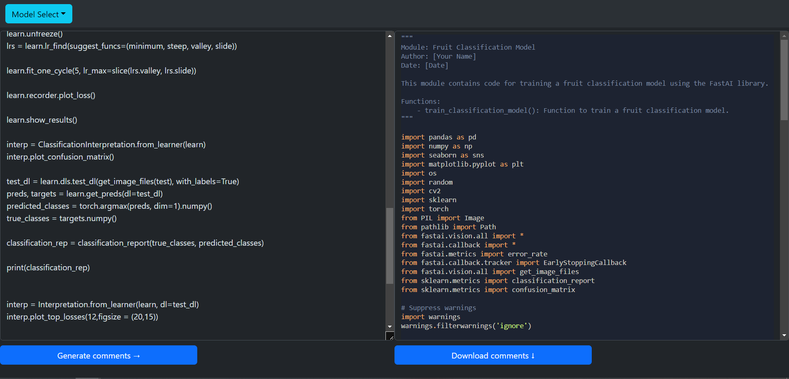
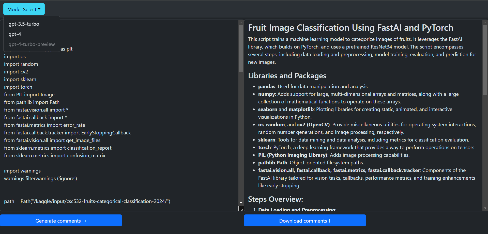

# code-comment-ai-test
Test app for automatically commenting code using generative AI

Before running: 
1. Create a copy of .env.txt
2. Replace the text between quotes with your OpenAI API key
3. Save the copy as .env in the root directory

You may optionally run the start.bat file to run the app and this will automatically create a venv for this app.

If you do not wish to utilize the provided batch file, simply running `flask run` in a terminal in the root directory will start the app if all requirements have been installed.

# Explanation
This application aims to use a LLM to review user-submitted code and provide them with helpful comments so that the code is understandable to programmers of all skill levels. This is accomplished through the use of system prompts that have been tuned to encourage the LLM to provide the desired results.
***
On the left-hand side of the screen, a text box is provided to paste in the code that the user would like to be analyzed. In future iterations, the user would ideally be able to load files from their local hard disk or from URLs from trusted providers such as Github or Kaggle. 

Once the code has been pasted, the user can click the `Generate Comments` button to send the code to the LLM for processing. Once the LLM has processed the code and generated its comments and documentation, the results will be populated in the text box on the right-hand side of the screen. 

From there, the user can click the `Download Comments` button to save the result as a markdown file on their hard disk.

By default, the app currently points to the gpt-3.5-turbo model offered by OpenAI. This can be changed to either the gpt-4 or gpt-4-turbo-preview models by clicking the `Model Select` button in the top left corner of the screen.

# Considerations
Currently, the app utilizes the OpenAI API for LLM access. This will incur operating costs for the provider of the API key as the OpenAI API is not free-to-use.

As with any LLM-based project, there is no guarantee of the result's accuracy. While results have appeared satisfactory in testing, all outputs should be regarded with caution and fact-checked when possible.

Due to the nature of the LLM queries, results are not consistent. While the system prompt can be fine-tuned to encourage desired outputs more often, the nature and structure of outputs can vary for even the same block of code.

At this point in time, the app currently does no validation of user input. User input is not processed in a manner that should not allow for arbitrary code execution, but this is not guaranteed. There are no sanity checks for potential jailbreaking, so caution should be exercised when running this app and allowing users you don't trust to utilize your API key.

# Future Ideas
As discussed above, in the future users would ideally be able to load programs from an external source without having to copy and paste them into a text box.

Alternative LLMs could be provided and freely selected as desired.

Currently, changing OpenAI models refreshes the page, which clears both the input and output. Ideally, this behavior would be adjusted to either not refresh the page or to preserve both fields.

The system prompt being sent through the API is currently hardcoded in the backend. It would be nice to be able to tweak the system prompt or choose from an editable list of system prompts so that they could be fine-tuned for specific languages or use cases.

Some sort of loading indicator would potentially make it more obvious when the application is waiting on a response from the LLM. The input box and submit buttons are disabled during this time, but this may not sufficiently indicate that the app is working as expected and is simply waiting on a response.

It may be nice to be able to adjust the width of the two text fields instead of having them both be locked to 50% of the screen's width.